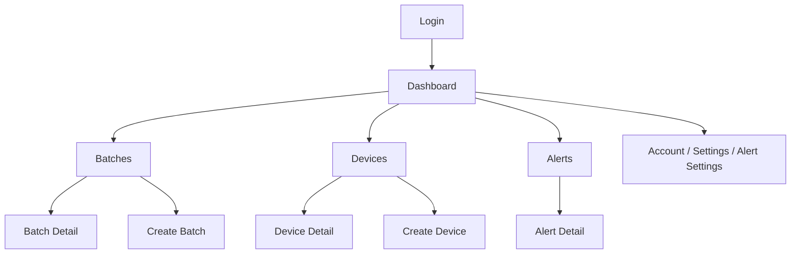

# Heat Treatment Workflow

## Product Flow

The app centers on four operational areas:

1. Authentication
2. Dashboard monitoring
3. Batch management
4. Device and alert management

## Screen Flow

## Batch Workflow

- Create a batch from the batch create screen.
- Review batch status on the batch list and batch detail screens.
- Use React Query mutations for create/update actions.
- Invalidate the batch list and related detail queries after successful mutations.

## Device Workflow

- View the device list from the devices tab.
- Open device detail to inspect parameters and telemetry.
- Create a device from the dedicated create screen.
- Use query invalidation after device mutations.

## Alerts Workflow

- View active or historical alerts from the alerts tab.
- Open alert detail for context and resolution data.
- Keep alert badge counts and list data in sync through React Query.

## Dashboard Workflow

- Dashboard is the entry point after login.
- It should summarize production health, batches, devices, and alerts.
- Use query-driven widgets and keep the layout responsive with shared components.

## Release and Version Flow

1. Update the version/build in `app.config.ts`
2. Run `yarn sync:version --version <x.y.z> --build <n>`
3. Validate that `package.json` and `src/lib/constants/app-version.ts` match
4. Run `yarn validate`
